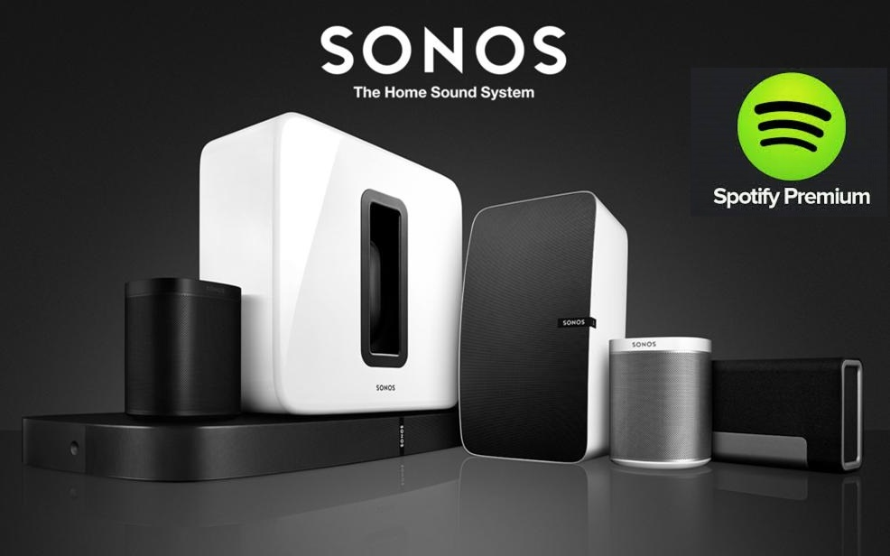
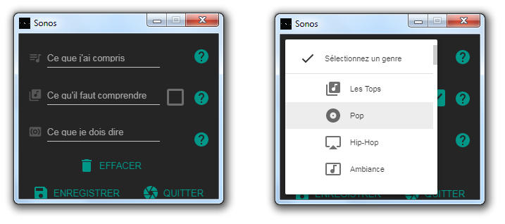

### _SonosPlayer permet le contrôle de tous vos appareils et toute votre musique Sonos par [A.V.A.T.A.R](https://spikharpax.github.io/A.V.A.T.A.R/)_

***
## ★ Caractéristiques

* Découverte automatique des appareils
* Utilisation des appareils Sonos comme enceintes Wi-fi pour les clients A.V.A.T.A.R
	* Dialogues et questions/réponses entièrement synchronisés
	* Compatibilité avec tous les plug-ins sans modification
	* Permet d'avoir un client mappé avec sa propre enceinte Sonos
	* Client mobile Android pouvant transférer ses dialogues vers l'enceinte Sonos de la pièce courante
* Entièrement multi-rooms, incluant les clients mappés
* Coupure et remise automatique du son lors d'un dialogue avec gestion du mode _loop_ inclus
* Gestion de vos bibilothèques musicales Sonos par sélection directe ou recherche et sélection par dialogue des:
	* Listes de lecture importées
	* Favoris
	* Compositeurs
	* Listes de lecture
	* Albums
	* Artistes
	* Genres
	* Pistes
* Gestion de vos bibilothèques musicales Spotify (Compte Premium requis) 
	* Sélection directe ou recherche et sélection par dialogue des:
		* Albums
		* Listes de lecture
	* Recherche de musique Spotify par titre, titre et artiste, genre, artiste
	* Commande vocale d'ajout de l'album en cours dans vos albums Spotify
* Gestion de vos radios préférées par sélection directe ou recherche et sélection par dialogue
* Commandes vocales supplémentaires:
	* Informations sur l'écoute en cours
	* Démarrer/stopper la musique
	* Volume (légèrement et fort)
	* Couper/remettre le son
	* Musique suivante/précédente
	* Transfert de la source télévision sur la playBar
* Réveil et programmation (nécessite le plug-in [scenariz](https://github.com/Spikharpax/Avatar-Plugin-scenariz))
* Fenêtre de saisie
	* Permet de saisir et de mémoriser un artiste, album, favori... si le dialogue n'est pas reconnu et/ou de saisir ce qu'A.V.A.T.A.R doit retourner comme phrase de validation.
	* Liste déroulante des genres de musiques Spotify pour une sélection directe.

***
## ★ Installation
* Téléchargez le projet depuis la bibliothèque de plug-ins A.V.A.T.A.R

***
## ★ Configuration et utilisation
* Ouvrez le Plug-in Studio A.V.A.T.A.R
* Cliquez sur l'icône du plug-in
* Dans son menu déroulant, cliquez sur _Documentation_

***
## ★ Crédits
* [node-sonos](https://github.com/bencevans/node-sonos)
* [spotify-web-api-node](https://github.com/thelinmichael/spotify-web-api-node)

***
## ★ Historique
* Version 2.2 (15-01-2021): 
	* Suppression du Listener 'PlayState' et remplacement par Sox pour la recherche de la durée des wav
* Version 2.1 (07-12-2020): 
	* Correction dans la recherche de musique
	* mise à jour des règles
* Version 2.0 (15-06-2020): 
	* Dialogue avec A.V.A.T.A.R optimisés et en streaming
	* Comptatibilité totale avec la nouvelle version du plugin Google-Assistant
* Version 1.5 (02-09-2019): 
	* La voix Sonos peut maintenant être changée add-hoc depuis le nouveau client Web API A.V.A.T.A.R
* Version 1.4 (29-05-2019): 
	* Stabilisation du code et améliorations
	* Correction et ajout de règles vocales pour la recherche par Titre (Spotify)
* Version 1.3 (18-03-2019): 
	* Amélioration de la restitution des informations de lecture
	* Correction de la lecture pour la fonction réveil
* Version 1.2 (07-03-2019): 
	* Amélioration de la gestion simultanée des possibilités de configurations de clients (réels, mappés, Android)
	* Amélioration de la gestion simultanée des possibilités de configurations d'enceintes (PC, Pièces Sonos, Android)
* Version 1.1 (04-03-2019): 
	* Correction dans la recherche par Artiste (Spotify)
	* Correction dans la recherche du lexic
* Version 1.0 (02-03-2019): Released

***
## ★ License
Logiciel libre sous [licence MIT](https://github.com/Spikharpax/A.V.A.T.A.R/blob/master/LICENSE)

Copyright (c) 2019 A.V.A.T.A.R - Stéphane Bascher

  